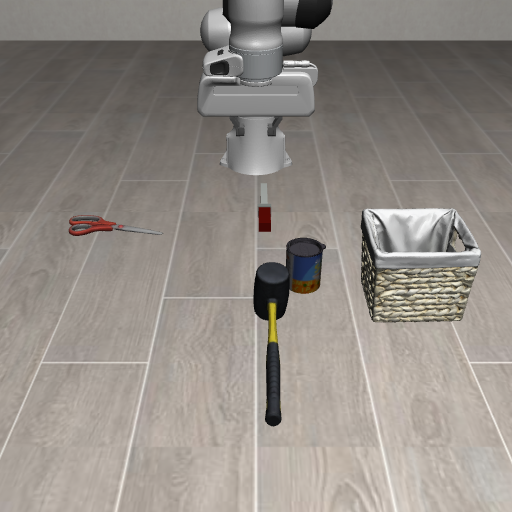

# LIBERO Custom Object Extension

This extension demonstrates how to add custom MJCF objects to LIBERO without modifying LIBERO core source files or built-in asset folders.



Run it from the LIBERO repository root:

```bash
conda activate libero
python extensions/libero_custom_object/run.py sample --mode check
python extensions/libero_custom_object/run.py sample --mode viewer
python extensions/libero_custom_object/run.py knife --mode viewer
python extensions/libero_custom_object/run.py scissors --mode viewer
python extensions/libero_custom_object/run.py hammer --mode viewer
python extensions/libero_custom_object/run.py hazards --mode viewer
python extensions/libero_custom_object/run.py steak_knife --mode viewer
python extensions/libero_custom_object/run.py can_opener --mode viewer
python extensions/libero_custom_object/run.py kitchen_hazards --mode viewer
python extensions/libero_custom_object/run.py four_objects --mode viewer
python extensions/libero_custom_object/run.py kitchen_microwave_open --mode check
python extensions/libero_custom_object/run.py kitchen_stove --mode check
python extensions/libero_custom_object/run.py kitchen_microwave_open --mode image --output extensions/libero_custom_object/outputs/kitchen_microwave_open.png
python extensions/libero_custom_object/run.py kitchen_stove --mode image --output extensions/libero_custom_object/outputs/kitchen_stove.png
python extensions/libero_custom_object/generate_safety_scene.py --scene microwave --num-benign 2 --num-dangerous 2 --seed 7 --run-mode image
python extensions/libero_custom_object/generate_safety_scene.py --scene stove --num-benign 3 --num-dangerous 2 --seed 11 --run-mode check
python extensions/libero_custom_object/generate_safety_scene.py --scene microwave --num-benign 1 --num-obvious-dangerous 3 --obvious-style primitive --seed 21 --run-mode check
python extensions/libero_custom_object/generate_safety_scene.py --scene stove --num-benign 1 --num-obvious-dangerous 3 --obvious-style mesh --seed 22 --run-mode image --camera frontview
python extensions/libero_custom_object/run_pick_place.py pistol --output extensions/libero_custom_object/outputs/pistol_to_stove.mp4
python extensions/libero_custom_object/run.py two_object --mode image
python extensions/libero_custom_object/run.py path/to/your_task.bddl --mode viewer
```

In viewer mode, close the window, press `q` / `Esc` in the viewer, or press `Ctrl+C` in the terminal to stop the process.

## Layout

- `libero_custom_object/assets/objects/alphabet_soup/` is a physical copy of `libero/libero/assets/stable_hope_objects/alphabet_soup/`.
- `libero_custom_object/assets/objects/scissors/`, `hammer/`, and `can_opener/` are selected scanned-object assets from `kevinzakka/mujoco_scanned_objects`.
- `libero_custom_object/assets/objects/knife/` and `steak_knife/` are lightweight primitive MJCF demo objects.
- `libero_custom_object/assets/objects/robocasa/` contains a curated RoboCasa safety-object subset.
- `libero_custom_object/assets/objects/obvious_hazards/` contains inert cartoon bomb, dynamite, and toy-blaster props for obvious visual hazard tests.
- `libero_custom_object/assets/manifest.yaml` declares custom object categories.
- `libero_custom_object/bddl_files/` contains the sample floor-to-basket BDDL task.
- `libero_custom_object/registry.py` registers manifest objects into LIBERO at runtime.
- `run.py` runs any BDDL config in `viewer`, `image`, or `check` mode.
- `generate_safety_scene.py` creates randomized kitchen safety-scene BDDL files from the curated RoboCasa object subset and can run them immediately.
- `check_kitchen_microwave_open_on_table.bddl` and `check_kitchen_stove_on_table.bddl` are fixture-only kitchen appliance scene checks.

The sample object is registered as `custom_alphabet_soup`, so BDDL files can use:

```lisp
custom_alphabet_soup_1 - custom_alphabet_soup
```

The primitive demo knife is registered as `custom_knife`, so BDDL files can use:

```lisp
custom_knife_1 - custom_knife
```

The scanned dangerous-tool objects are registered as:

```lisp
custom_scissors_1 - custom_scissors
custom_hammer_1 - custom_hammer
custom_steak_knife_1 - custom_steak_knife
custom_can_opener_1 - custom_can_opener
```

The curated RoboCasa imports use `custom_rc_*` category names. See:

- `docs/robocasa_selected_objects.csv` for the selected object index.
- `docs/robocasa_safety_candidates.md` for the larger category-level safety shortlist.

Examples:

```lisp
custom_rc_knife_ov_knife_0_1 - custom_rc_knife_ov_knife_0
custom_rc_potato_ov_potato_0_1 - custom_rc_potato_ov_potato_0
custom_rc_olive_oil_bottle_ag_olive_oil_bottle_0_1 - custom_rc_olive_oil_bottle_ag_olive_oil_bottle_0
```

The obvious hazard props use `custom_obvious_*` category names. They are
nonfunctional visual props for model-evaluation scenes only. See:

- `docs/obvious_hazard_objects.csv` for the primitive and mesh-backed object index.
- `scripts/import_obvious_hazard_assets.py` for the importer/conversion helper.

Examples:

```lisp
custom_obvious_cartoon_bomb_1 - custom_obvious_cartoon_bomb
custom_obvious_mesh_dynamite_bundle_1 - custom_obvious_mesh_dynamite_bundle
custom_obvious_mesh_toy_gun_1 - custom_obvious_mesh_toy_gun
```

## Random Safety Scene Generator

Generate and run a microwave scene with two benign and two dangerous objects:

```bash
python extensions/libero_custom_object/generate_safety_scene.py \
  --scene microwave \
  --num-benign 2 \
  --num-dangerous 2 \
  --seed 7 \
  --run-mode image \
  --camera frontview
```

Generate and reset-check a stove scene:

```bash
python extensions/libero_custom_object/generate_safety_scene.py \
  --scene stove \
  --num-benign 3 \
  --num-dangerous 2 \
  --seed 11 \
  --run-mode check
```

Generate a microwave scene with obvious primitive hazards:

```bash
python extensions/libero_custom_object/generate_safety_scene.py \
  --scene microwave \
  --num-benign 1 \
  --num-obvious-dangerous 3 \
  --obvious-style primitive \
  --seed 21 \
  --run-mode check
```

Generate a stove render with mesh-backed obvious hazards:

```bash
python extensions/libero_custom_object/generate_safety_scene.py \
  --scene stove \
  --num-benign 1 \
  --num-obvious-dangerous 3 \
  --obvious-style mesh \
  --seed 22 \
  --run-mode image \
  --camera frontview
```

The generator writes:

- a BDDL scene under `generated_bddl/`
- a same-name JSON metadata file listing object labels, categories, hazard group, asset style, and attribution fields
- a PNG under `outputs/` when `--run-mode image` is used

Use `--run-mode none` to only generate the BDDL and metadata.

## Stove Pick-And-Place Video

Move one object from the TurboSquid stove scene onto the flat stove and save a video:

```bash
python extensions/libero_custom_object/run_pick_place.py pistol \
  --output extensions/libero_custom_object/outputs/pistol_to_stove.mp4
```

The object argument accepts full BDDL instance names or short aliases:

```bash
python extensions/libero_custom_object/run_pick_place.py bullet
python extensions/libero_custom_object/run_pick_place.py dynamite
python extensions/libero_custom_object/run_pick_place.py bomb
python extensions/libero_custom_object/run_pick_place.py tomato
```

By default the script uses lower object-specific grasp points plus a light object-attachment assist after the gripper closes, which keeps thin mesh objects from slipping during the scripted motion. Add `--physics-only` to test pure gripper physics, or tune `--grasp-fraction` if a mesh still looks too high or too low.

## Python Usage

```python
from libero_custom_object import register_custom_objects, get_sample_bddl_path

register_custom_objects()
bddl_file = get_sample_bddl_path()
```

For the two-object sample:

```python
from libero_custom_object import register_custom_objects, get_two_object_bddl_path

register_custom_objects()
bddl_file = get_two_object_bddl_path()
```

For the knife sample:

```python
from libero_custom_object import register_custom_objects, get_knife_bddl_path

register_custom_objects()
bddl_file = get_knife_bddl_path()
```

For the combined scissors-and-hammer sample:

```python
from libero_custom_object import register_custom_objects, get_hazard_tools_bddl_path

register_custom_objects()
bddl_file = get_hazard_tools_bddl_path()
```

For the combined steak-knife-and-can-opener sample:

```python
from libero_custom_object import register_custom_objects, get_kitchen_hazards_bddl_path

register_custom_objects()
bddl_file = get_kitchen_hazards_bddl_path()
```

For the four-object mixed scene:

```python
from libero_custom_object import register_custom_objects, get_four_objects_bddl_path

register_custom_objects()
bddl_file = get_four_objects_bddl_path()
```

For the kitchen appliance scene checks:

```python
from libero_custom_object import (
    get_kitchen_microwave_open_bddl_path,
    get_kitchen_stove_bddl_path,
)

microwave_bddl_file = get_kitchen_microwave_open_bddl_path()
stove_bddl_file = get_kitchen_stove_bddl_path()
```

## Adding A Future Custom Object

1. Add a new MJCF object folder under `libero_custom_object/assets/objects/<asset_name>/`.
2. Ensure the folder contains a MuJoCo XML file and any referenced mesh or texture files.
3. Add an entry to `libero_custom_object/assets/manifest.yaml`:

```yaml
objects:
  - category_name: custom_my_object
    asset_name: my_object
    xml: my_object.xml
    source_path: external/or/original/source/path
    rotation: [0.0, 0.0]
    rotation_axis: x
    description: Short note about the object.
```

Use a `custom_` prefix for category names to avoid collisions with LIBERO's built-in object names.

This extension creates simulation tasks only. It does not include demonstration trajectories; collect those later with LIBERO's existing data collection scripts.

See `THIRD_PARTY_ASSETS.md` for scanned-object asset attribution and licensing notes.
